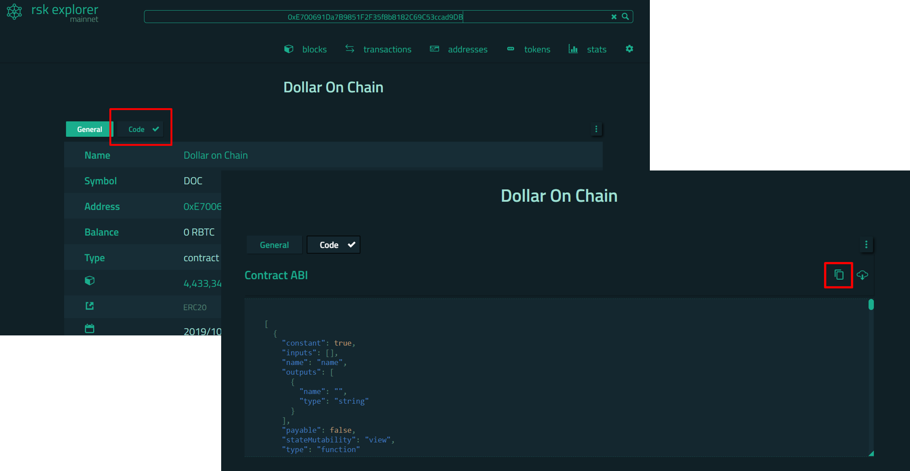

# Blockchain logs translator

###Paste the ABI, data and topic that needs translation from any EVM based blockchain.

Please find the description and examples of all the procedures in RSK. 

> The Contract Application Binary Interface (ABI) is **the standard way
> to interact with contracts in the Ethereum ecosystem, both from
> outside the blockchain and for contract-to-contract interaction**.
Source: [Solidity Docs](https://docs.soliditylang.org/en/v0.8.13/abi-spec.html#:~:text=The%20Contract%20Application%20Binary%20Interface,as%20described%20in%20this%20specification.)

The ABI can be found in the code tab of the corresponding rsk explorer. Please see an example as follows: 

Once copy, paste it where it says "ABI". 

Data and topics are part of the logs and can be retrieved by multiple sources. RSK's real time data is available in [Covalent](https://www.covalenthq.com/platform/#/auth/login) that enabled queries to surf the chain. In order to retrieve the data it will be necessary a registry. 

Some examples follow: 

 - Data:  0x00000000000000000000000000000000000000000000006cc463b4cb4ba0e000 
 Data's format is a string. 
 - Topics: ['0xddf252ad1be2c89b69c2b068fc378daa952ba7f163c4a11628f55a4df523b3ef', '0x0000000000000000000000000000000000000000000000000000000000000000', '0x000000000000000000000000804b03d7144a80aacf633670489e6c740797d84f']
 Topic's format is a list. The first element of the list is the event name and the subsequent elements correspond to the paramenters of the function. 

# Result

The result will be a json with the following response: 

> function called:  Transfer arguments: {"from":
> "0x0000000000000000000000000000000000000000", "to":
> "0x804B03D7144a80AACF633670489e6c740797D84F", "value": 2500000000}

## Caveat

If the ABI relates to a proxy smart contract, for example like: '*0x6acb83Bb0281FB847B43cf7DD5e2766bfDf49038*', the translator will not work. 
The published ABIs for those kind of contracts do not match with the topics and cannot be translated. 
 

## License 

The source code for the site is licensed under the MIT license, which you can find in the MIT-LICENSE.txt file.

**Sponsoring**

If you would like to support this project, considering sponsoring through the following addresses: 

 - 0x04c36DCB572fad0b0F05b3b4DD4a2d95ca71A724 (DOC)
 - 0x04C36DcB572FAD0b0f05B3B4dd4A2d95Ca71a724 (eth) 